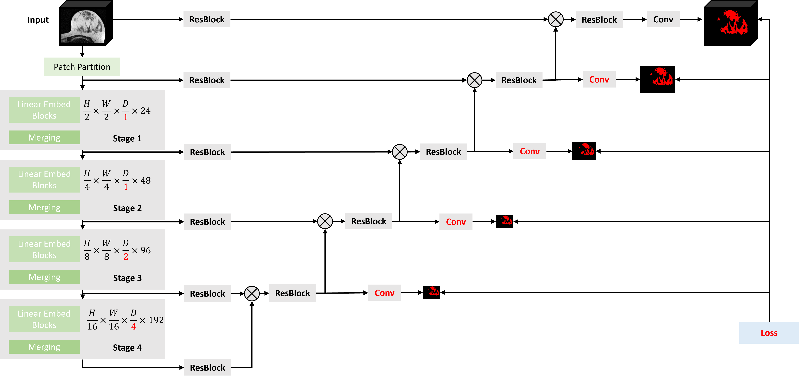

# TraBS - Transformer Breast Segmentation
Segmentation of fibroglandular tissue in breast MRI with neural networks

Paper
=======
ArXiv: [**Fibroglandular Tissue Segmentation in Breast MRI using Vision Transformers - A multi-institutional evaluation**](https://doi.org/10.48550/arXiv.2304.08972)

*Figure: SwinTransformer for Breast Segmentation (TraBS)*

Data 
===========
* Segmentation masks for the [DUKE](https://doi.org/10.7937/TCIA.e3sv-re93) dataset are saved at : [data/Duke](data/Duke)

Install
=============

Create virtual environment and install packages: \
`python -m venv venv` \
`source venv/bin/activate`\
`pip install -e .`

Get Started 
=============

1 Prepare Data
-------------
* Go to [breaststudies/data/dataset_breast.py](breaststudies/data/dataset_breast.py) and create a new Dataset based on `BaseDataset`. 
* Go to [breaststudies/data/datamodule_breast.py](breaststudies/data/datamodule_breast.py) and create a new DataModule based on `BaseDataModule`. 

2 Train  
----------------
* Optional: Pretrain model:  [scripts/main_pretrain.py](scripts/main_pretrain.py)
* Train model: [scripts/main_train.py](scripts/main_train.py) 

2.1 Predict  
----------------
* For the cross-fold prediction: [scripts/main_predict_kfold.py](scripts/main_predict_kfold.py)
* For the (ensemble-) prediction on an external dataset: [scripts/main_predict.py](scripts/main_predict.py)
